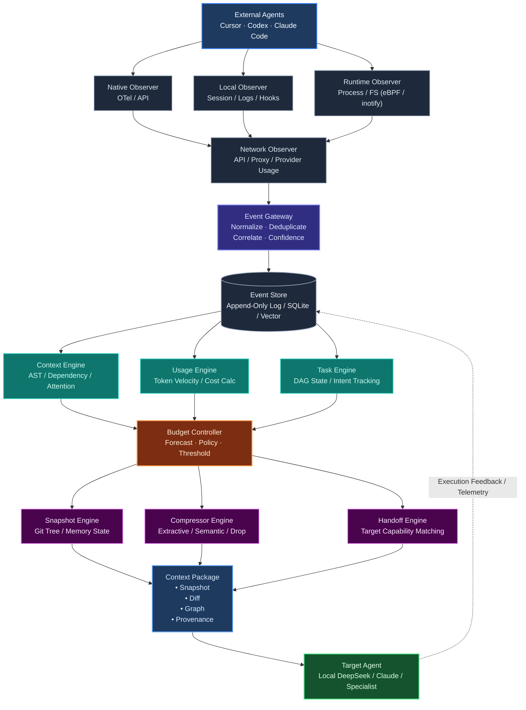

# AgentForge v2.1 详细系统架构设计文档

> **版本**：v2.1  
> **状态**：设计完成 / 待评审（Pre-Implementation Design）  
> **核心演进**：从 v1.0 的单一指令转发式 “Cloud Brain + Local Executor” 演变为面向多 Agent 协同的 **“分布式事件可观测、预算驱动、上下文高压缩流转与状态安全交接系统”**。

---

## 1. 架构总览与演进背景

### 1.1 演进动因
在 v1.0 中，系统建立了宿主在线模型（Cursor/Claude/Codex）通过 MCP 驱动本地容器执行环境（Local Agent Gateway）的单向执行链路。但在多智能体协同、长周期任务与跨模型上下文切换中，面临如下关键挑战：
1. **多 Agent 盲区与状态黑盒**：无法精准捕捉不同 External Agent（Cursor, Codex, Claude Code 等）在执行期间的思维链演化、文件操作边界与 Token 消耗细节。
2. **上下文膨胀与窗口溢出**：长任务下全量历史导致昂贵的 API 费用、注意力漂移（Lost in the Middle）与上下文超限。
3. **跨 Agent 无损交接（Handoff）缺失**：当主力规划 Agent 需将任务转交至专业编码 Agent 或成本更优的模型时，缺乏标准化的上下文剪裁、代码快照、调用图分析与因果凭据（Provenance）。
4. **缺乏动态预算与反馈自闭环**：无法根据剩余 Token 预算动态调整压缩策略，缺乏执行结果对事件流的闭环校准。

### 1.2 v2.1 系统拓扑图 (Mermaid)



---

## 2. 分层架构与核心模块详细设计

系统逻辑上划分为 6 大核心层级：
1. **多源多模态可观测感知层（Observer Layer）**
2. **事件接入与归一化网关层（Event Gateway & Store）**
3. **状态分析与意图推断引擎层（Analysis Engines）**
4. **动态预算与自适应决策控制器（Budget Controller）**
5. **上下文生成与高压缩输出引擎层（Context Transformation Engines）**
6. **上下文封装与目标 Agent 交付层（Context Package & Target Handshake）**

---

### 2.1 第一层：多源可观测感知层 (Observer Layer)

针对不同 Agent 客户端的封闭程度，采用四维立体感知矩阵：

#### (1) Native Observer (原生探针)
- **职责**：监听具备标准遥测能力或支持 API Hook 的客户端。
- **采集点**：
  - OpenTelemetry (OTel) Trace / Span 采集（若客户端开启遥测导出）。
  - IDE 插件层事件（VS Code Extension API / LSP 通知：文件焦点、选中区间、光标跃迁）。
- **特点**：高精度、低开销，结构化程度最高。

#### (2) Local Observer (本地会话与日志探针)
- **职责**：针对无法直接注入探针的客户端（如闭源 Cursor、Claude Code CLI），解析其本地持久化工作痕迹。
- **采集点**：
  - SQLite 数据库增量监听（如 Cursor `state.vscdb` 中的 chatSessions、composerData）。
  - 日志流监听（Claude Code `~/.claude/logs/*.jsonl`，Codex Session History）。
  - Git Pre-tool-use / Post-tool-use Hooks。
- **机制**：文件句柄与 Tail 监听，解析增量 JSON/Protobuf，恢复原始 Prompt 与 Tool Call 序列。

#### (3) Runtime Observer (运行环境探针)
- **职责**：从 OS 与沙箱底层监测 Agent 的物理行为，防止工具欺骗与幻觉逃逸。
- **采集点**：
  - **FS 监听**：基于 `inotify` (Linux) / `FSEvents` (macOS) 实时追踪代码库文件的 Create/Modify/Delete。
  - **Process 监听**：拦截 Bash 执行、测试执行进程树（Process Tree）、Exit Code 捕获。
  - **Git 状态**：Working tree 脏状态、未追踪文件、HEAD 偏移。

#### (4) Network Observer (网络与代理中间件探针)
- **职责**：处于 Agent 与上游 LLM Provider（OpenAI/Anthropic/xAI/DeepSeek）之间。
- **机制**：
  - 本地透明代理（MITM Proxy）或 Reverse Proxy（配置 `OPENAI_BASE_URL`）。
  - 拦截 HTTP Headers 与 Payload 中的 `usage` 字段（`prompt_tokens`, `completion_tokens`, `cached_tokens`）。
  - 记录模型响应延迟（TTFT - Time to First Token, TPOT - Time per Output Token）。

---

### 2.2 第二层：事件网关与事件存储 (Event Gateway & Store)

#### 2.2.1 Event Gateway 核心管线
多源探针产生的原始事件存在乱序、重复和数据格式各异的特点，网关按以下 4 步管线处理：

1. **Normalize (归一化)**：统一抽象为 **Standard Agent Event (SAE)** 格式。
```json
{
  "event_id": "evt_01J8ZX7K9A...",
  "timestamp": 1726840000123,
  "source": {
    "client": "cursor",
    "observer": "runtime_observer",
    "session_id": "sess_abc123"
  },
  "type": "tool_call.bash.complete",
  "payload": {
    "command": "pytest tests/test_auth.py",
    "exit_code": 0,
    "stdout_snippet": "3 passed in 0.42s"
  },
  "correlation_id": "corr_task_456",
  "confidence": 1.0
}
```
2. **Deduplicate (去重)**：Local 日志抓取与 Network 代理抓取可能存在重叠事件。基于 `(session_id, client_request_hash, timestamp_window)` 滑动窗口执行幂等去重。
3. **Correlate (因果关联)**：构建任务因果链（Parent-Child 关系），将 Prompt -> Tool_Call -> File_Write -> Bash_Exec -> Error 关联至统一追踪链路。
4. **Confidence (置信度打分)**：综合多探针输入（如 Network 显示写入成功，但 Runtime FS 未见文件，则降低置信度并标记警告）。

#### 2.2.2 Event Store (事件存储)
- **热存储 (Hot Storage)**：轻量级嵌入式 SQLite / DuckDB（支持行级快速追加与时序窗口查询）。
- **图存储 (Graph/Vector Index)**：将代码变更实体与 Prompt 关联为关系图谱，并为长对话文本生成向量索引以便按需检索。

---

### 2.3 第三层：状态分析与推断引擎 (Analysis Engines)

#### (1) Context Engine (上下文理解与拓扑引擎)
- **AST / Call Graph 分析**：解析被修改文件在项目中的上下游依赖（哪些模块 import 了被修改类）。
- **Working Set 提取**：结合 Agent 浏览与编辑记录，计算当前任务的“高频关注代码集合”。
- **信息熵与注意力衰减计算**：根据时间与轮次对早期无关交互进行权重衰减。

#### (2) Usage Engine (用量与消耗速率引擎)
- **Token 速度追踪**：计算每分钟 Token 消耗率（Token Velocity）。
- **成本累加与缓存命中率**：精确核算 Prompt Caching 命中率、实际 API 消耗金额。
- **趋势预测**：推断若以当前速率运行，距离窗口上限或预算耗尽还剩多少交互轮次。

#### (3) Task Engine (任务目标与状态机引擎)
- **DAG 状态机管理**：将外部 Agent 的粗粒度目标分解为当前执行阶段（探索、编码、修复、验证）。
- **死循环与卡顿检测**：检测 Agent 是否在连续尝试同一失败命令（例如连续 3 次相同语法错误）。

---

### 2.4 第四层：动态预算控制器 (Budget Controller)

#### 2.4.1 核心控制算法与策略
预算控制器是连接分析层与压缩转换层的“智能节流阀”。
- **Forecast (预测)**：`Remaining_Budget = Min(Max_Window_Limit - Current_Tokens, Cost_Quota - Spent_Cost)`。
- **Policy 策略矩阵**：
  | 剩余预算比例 | 系统状态 | 控制策略 (Policy) |
  |---|---|---|
  | **> 50%** | Green (充裕) | 无损透传，保留完整代码上下文与完整调用历史 |
  | **25% - 50%** | Yellow (紧缩) | 抽取式压缩：修剪长 Shell 输出，代码用 AST 骨架替代无关函数 |
  | **10% - 25%** | Orange (警报) | 语义总结压缩：仅保留重要决策点、Git Diff 及关键错误日志 |
  | **< 10%** | Red (临界) | 强制触发 **Handoff (任务交接)** 或快照归档并重启 Context |

---

### 2.5 第五层：上下文生成与高压缩输出引擎 (Transformation Engines)

#### (1) Snapshot Engine (状态快照引擎)
- 抓取原子级别的代码工作区快照：
  - Git `commit-tree` 级别虚拟快照（不污染当前分支）。
  - 环境变量与当前已安装依赖列表。
  - 当前测试运行结果及 Exit Code。

#### (2) Compressor Engine (压缩引擎)
- **分层智能压缩**：
  - **Tool Output Truncation**：对长日志提取头尾并做异常模式聚类。
  - **Code AST Folding**：折叠未修改的类方法体，仅保留签名与类型注释。
  - **LLM-based Summarization**：使用低成本本地模型将 20 轮试错过程压缩为一段结构化的“决策经验与教训”。

#### (3) Handoff Engine (交接路由引擎)
- 评估交接目标 Agent（Target Agent）的模型属性：
  - 上下文窗口容量（如 32k / 128k / 1M）。
  - 支持的 Prompt 风格与 Tool 协议（OpenAI Tool format / Claude XML / MCP）。
  - 针对目标特性调整输出语言与协议包裹层。

---

### 2.6 第六层：上下文载荷包与目标交付 (Context Package & Target Handshake)

#### 2.6.1 Context Package 数据契约
生成自洽、不可变（Immutable）的标准交付数据包：
```
Context Package
├── 1. Snapshot: 纯净代码基线版本哈希与文件系统当前状态
├── 2. Diff: 自任务开始以来所有关键文件的结构化 Patch
├── 3. Graph: 任务相关受影响模块的调用链路图 (AST Dependency Map)
└── 4. Provenance: 决策证明溯源链 (为什么做这个决定、踩了什么坑、测试通过凭据)
```

#### 2.6.2 Target Agent 执行与反馈闭环 (Feedback Loop)
- 目标 Agent（本地微调小模型、或高性价比推理模型）接收 Package 开展工作。
- 目标 Agent 的执行结果与测试通过指标**反向注入 (Feedback) 至 Event Store**，作为后续策略优化的因果反馈数据。

---

## 3. 技术栈选型与关键技术决策

| 模块 | 推荐技术栈 | 选型理由 |
|---|---|---|
| **Core Daemon** | Python 3.11+ / Rust | 与现有一期 `local_agent` 兼容；对于高性能 FS/Network 监听支持极高并发 |
| **Event Gateway & Store** | DuckDB + SQLite (WAL) | 极快读写性能，支持单文件嵌入式部署，免去复杂依赖，适配本地开发环境 |
| **Network Proxy** | `mitmproxy` / 自研 ASGI 代理中间件 | 无感拦截 HTTP/SSE 协议，提取 Token Usage 与 Streaming 流 |
| **FS / Process Monitor** | `watchfiles` / `psutil` / macOS `FSEvents` | 跨平台兼顾 Mac/Linux，精确监测代码文件变动及子进程树 |
| **AST 解析与压缩** | `tree-sitter` (多语言支持) | 极速精准解析 Python, TS/JS, Go, Rust 的代码骨架与折叠 |
| **Agent 通信接口** | Model Context Protocol (MCP) + Stdio/SSE | 深度对齐行业标准，无缝兼容 Cursor, Claude Code, Codex |

---

## 4. 实施阶段与演进路线 (Roadmap)

- **Phase 1 (基础感知与事件统一)**：实现 Local Observer 与 Network Proxy，建立 Event Gateway 与 SQLite 存储，完成统一 SAE 事件格式化。
- **Phase 2 (分析引擎与预算决策)**：构建 Usage Engine 与 Token 消耗预警，实现基于规则与 Policy 的 Budget Controller。
- **Phase 3 (压缩与上下文打包)**：开发基于 `tree-sitter` 的 AST 代码骨架抽取器，设计 Context Package 生成与序列化。
- **Phase 4 (Handoff 与双向闭环)**：完成 Target Agent 的无缝接力运行，搭建执行结果向 Event Store 的反馈闭环机制。
