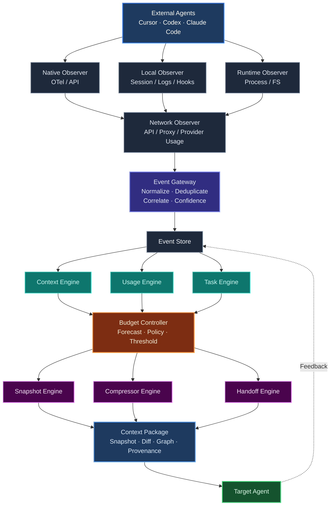

## Architecture Overview (v2.1)

```mermaid
flowchart TB
    %% ==================== Styles ====================
    classDef external fill:#1e3a5f,stroke:#3b82f6,stroke-width:2px,color:#fff
    classDef observer fill:#1e293b,stroke:#64748b,stroke-width:1.5px,color:#e2e8f0
    classDef gateway fill:#312e81,stroke:#818cf8,stroke-width:2px,color:#e0e7ff
    classDef store fill:#1e293b,stroke:#94a3b8,stroke-width:1.5px,color:#f1f5f9
    classDef engine fill:#0f766e,stroke:#2dd4bf,stroke-width:1.5px,color:#ccfbf1
    classDef budget fill:#7c2d12,stroke:#fb923c,stroke-width:2px,color:#ffedd5
    classDef output fill:#4a044e,stroke:#e879f9,stroke-width:1.5px,color:#fae8ff
    classDef package fill:#1e3a5f,stroke:#60a5fa,stroke-width:2px,color:#dbeafe
    classDef target fill:#14532d,stroke:#4ade80,stroke-width:2px,color:#dcfce7

    %% ==================== Nodes ====================
    External["External Agents<br/>Cursor · Codex · Claude Code"]

    Native["Native Observer<br/>OTel / API"]
    Local["Local Observer<br/>Session / Logs / Hooks"]
    Runtime["Runtime Observer<br/>Process / FS"]
    Network["Network Observer<br/>API / Proxy / Provider Usage"]

    Gateway["Event Gateway<br/>Normalize · Deduplicate<br/>Correlate · Confidence"]
    Store["Event Store"]

    Context["Context Engine"]
    Usage["Usage Engine"]
    Task["Task Engine"]

    Budget["Budget Controller<br/>Forecast · Policy · Threshold"]

    Snapshot["Snapshot Engine"]
    Compressor["Compressor Engine"]
    Handoff["Handoff Engine"]

    Package["Context Package<br/>Snapshot · Diff · Graph · Provenance"]
    Target["Target Agent"]

    %% ==================== Connections ====================
    External --> Native & Local & Runtime
    Native & Local & Runtime --> Network
    Network --> Gateway
    Gateway --> Store

    Store --> Context & Usage & Task
    Context & Usage & Task --> Budget

    Budget --> Snapshot & Compressor & Handoff
    Snapshot & Compressor & Handoff --> Package
    Package --> Target
    Target -.->|Feedback| Store

    %% ==================== Apply Styles ====================
    class External external
    class Native,Local,Runtime,Network observer
    class Gateway gateway
    class Store store
    class Context,Usage,Task engine
    class Budget budget
    class Snapshot,Compressor,Handoff output
    class Package package
    class Target target
```